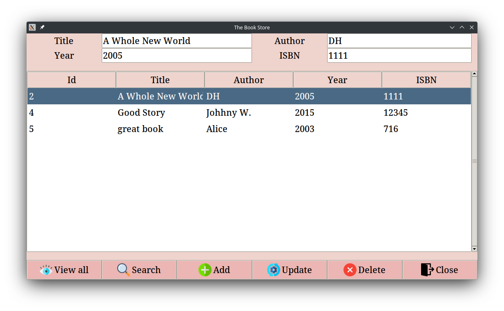

# Project Overview

This program contains both front-end and back-end code for a bookstore app with a simple graphical user interface (**GUI**)
built with [**Tkinter library**](https://docs.python.org/3/library/tk.html). While I personally might not choose Tkinter if I were to build a real-world app with modern UI,
Tkinter serves me well in terms of getting me familiar with how to connect to databases(**SQLite** in this case), manipulatie data, and 
reflect the changes on the front end with Python.

## How run?
`python3 main.py`

##  Screenshot 

